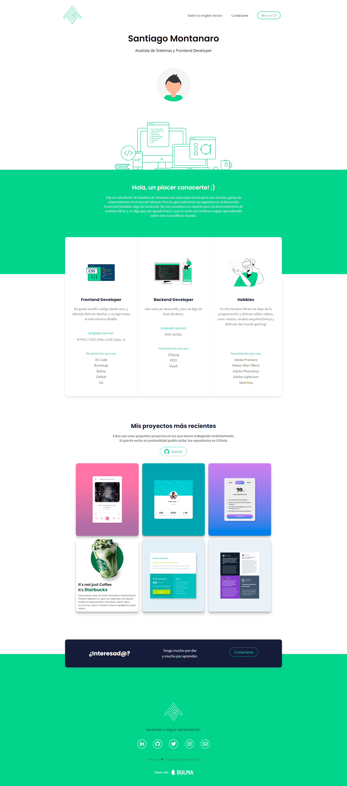

## Tabla de contenidos

- [Vistazo general](#Vistazo-general)
  - [Links](#links)
  - [Screenshot](#screenshot)
- [Mi proceso](#Mi-proceso)
  - [Construido con](#Construido-con)
- [Autor](#Autor)

## Vistazo general

- Un simple y bonito portfolio personal para que puedan ver un resumen de lo que puedo hacer y que herramientas utilizo :)

### Links

- Live Site URL: [https://santiagomontanaro.github.io/portfolio/]

### Screenshot

## Mi proceso

### Construido con

- Semantic HTML5 markup
- CSS3 custom properties
- CSS Grid Layout
- Flexbox
- Bulma
- Fontawesome
- Media Query

Y basado en Matt Farley

## Autor

- Twitter - [@santimontana_](https://twitter.com/santimontana_)
- Instagram - [@lllliiiiilllj](https://www.instagram.com/lllliiiiilllj/)
- Linkedin - [@santiago montanaro](https://www.linkedin.com/in/montsan/)
